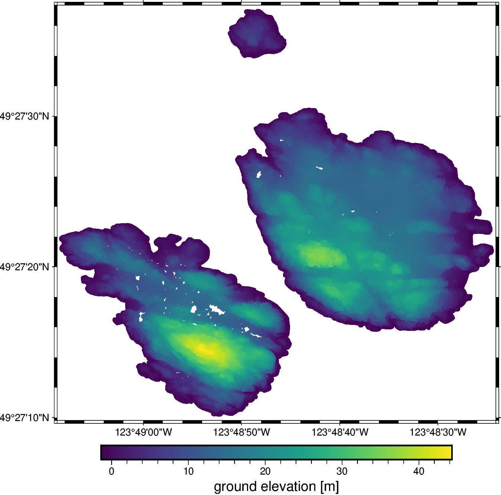

# British Columbia, Canada - Lidar point cloud

This is a point cloud sliced to the small
[Trail Islands](https://apps.gov.bc.ca/pub/bcgnws/names/21973.html) to the
North of Vancouver to reduce the data size.
The islands have some nice looking topography and their isolated nature creates
problems for some interpolation methods, like simple nearest-neighbors.

| | Summary |
|--:|:--|
| File | `british-columbia-lidar.csv.xz` |
| Size | 4.4 Mb |
| Version | [v1](https://github.com/fatiando-data/british-columbia-lidar/releases/latest) |
| DOI | https://doi.org/10.5281/zenodo.5881887 |
| License | [CC-BY](https://creativecommons.org/licenses/by/4.0/) |
| MD5 | `md5:354c725a95036bd8340bc14e043ece5a` |
| SHA256 | `sha256:03c6f1b99374b8c00c424c788cb6956bc00ab477244bb69835d4171312714fe1` |
| Source | [LidarBC](https://www2.gov.bc.ca/gov/content/data/geographic-data-services/lidarbc) |
| Original license | [Open Government Licence - British Columbia](https://www2.gov.bc.ca/gov/content/data/open-data/open-government-licence-bc) |
| Processing code | [`prepare.ipynb`](https://nbviewer.org/github/fatiando-data/british-columbia-lidar/blob/main/prepare.ipynb) |

## Changes made

> These are the changes made to the original dataset.

* Cut out a section of the original data to focus only on these small islands.
* Change UTM coordinates to geodetic latitude and longitude (WGS84).
* Keep only the ground reflection picks.
* Export to a compressed CSV for easier loading with Pandas.

## About this repository

This is a place to format and prepare the original dataset for use in our
tutorials and documentation.

We include the source code that prepares the datasets for redistribution by
filtering, standardizing, converting coordinates, compressing, etc.
The goal is to make loading the data as easy as possible (e.g., a single call
to `pandas.read_csv` or `xarray.load_dataset`).
Whenever possible, the code also downloads the original data (otherwise the
original data are included in this repository).

> 💡 **Tip:** The easiest way to download this dataset is using
> [Pooch](https://www.fatiando.org/pooch), particularly to download straight
> from the DOI of a release.

## Contributing

See our [Contributing Guidelines][contrib] for information on proposing new
datasets and making changes to this repository.

## License

All Python source code is made available under the BSD 3-clause license. You
can freely use and modify the code, without warranty, so long as you provide
attribution to the authors.

Unless otherwise specified, all data files and figures created by the code are
available under the Creative Commons Attribution 4.0 License (CC-BY).

See [`LICENSE.txt`](LICENSE.txt) for the full text of each license.

The license for the original data is specified in this `README.md` file.

[contrib]: https://github.com/fatiando-data/.github/blob/main/CONTRIBUTING.md
